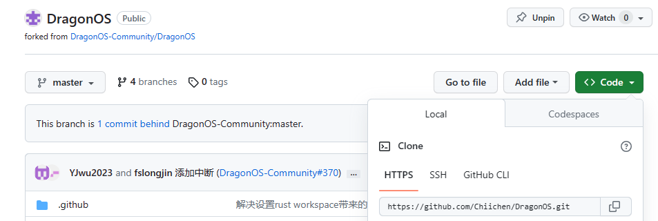
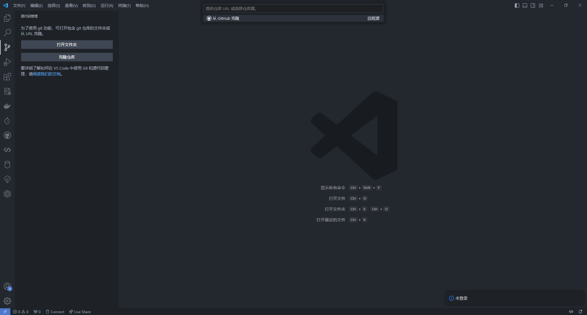
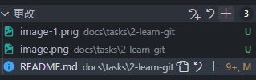
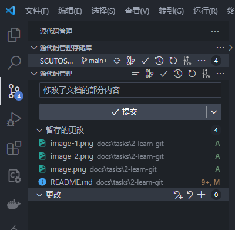
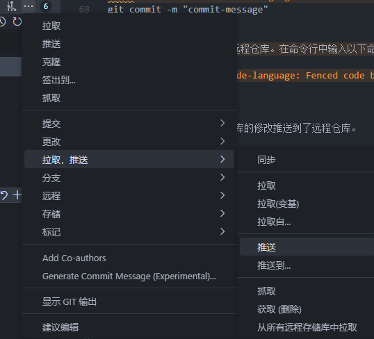
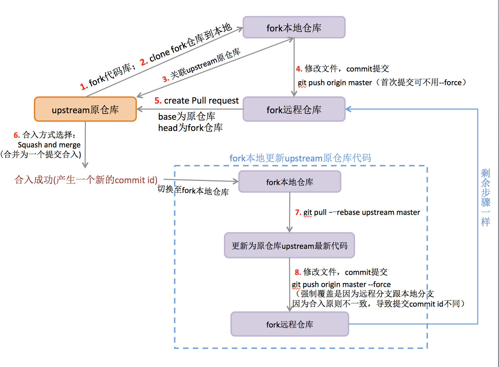

# #2 - 学习使用git

::: tip 本文维护者

- 池克俭 <chikejian@dragonos.org>

:::

[[toc]]

## 1. Git 是什么，Github 又是什么

- Git 是一个版本控制系统，就像一个时光机器，可以跟踪文件随时间的变化状态。它可以帮助程序员在团队协作中管理代码，以便于追踪、审查和恢复文件的历史版本。每个程序员都有文件的当前状态以及完整的历史记录，就像拥有一台可以随时返回过去任意时刻的时光机器。

- 而 Github 是一个基于 Git 的在线代码仓库，它提供了一个网站界面，使得用户可以远程存储、共享和协作管理代码。Github 相当于一个开放的广场，每个人都可以在这个广场上展示自己的项目并与他人交流。在 Github 上，你可以将自己的代码上传到这个广场上，也可以浏览别人的代码，甚至可以与他人合作，就像在广场上交流、合作一样。总之，Git 是一个工具，而 Github 是一个使用这个工具的平台。

## 2. Github，启动

### 2.1 准备工作

1. 首先，检查你的搜索引擎，如果是 `Google` ，就可以跳过这一步。如果是 X度 等，那么你就需要注意了。准备一个 `合适的网络环境` (可以咨询群内的师兄师姐，或者周围身边的同学)并且投入 `Google` 的怀抱，是你需要做的第一步。
2. 准备好网络环境后，就可以通过 [GitHub](https://github.com/) 开始你的旅程。你需要注册账号，登录账号，然后在 Repository 中创建你的第一个仓库，就可以进入下一步了
3. 光有远程仓库是不够的，因此你还需要在自己的电脑上安装 Git，详见[Git - 安装 Git (git-scm.com)](https://git-scm.com/book/zh/v2/%E8%B5%B7%E6%AD%A5-%E5%AE%89%E8%A3%85-Git) 。完成这一步之后，就可以进入下一个阶段了

### 2.2 Git 初探

- 在这个阶段，我们需要学习一些基本的 Git 语法，来使用 Git 这个趁手的兵器。
- 这里有一个可视化、交互式的 [Git 教程](https://oschina.gitee.io/learn-git-branching/)，对于刚刚接触的新手而言是一个不错的选择。
- 当然，你也可以选择[Git - Book (git-scm.com)](https://git-scm.com/book/zh/v2) 官方文档，这由你自己决定
- 如果你之前安装了 VSCode ，它自带了一个比较简单的图形化的 Git 界面，可以通过左侧—— `源代码管理` 来打开。通过点击 `克隆仓库` 可以把之前在 Github 创建的仓库克隆到本地，后续就可以通过前面学到的 Git 命令或者通过这个界面来操作这个仓库了

### 2.3 Git 小试

- 通过前面的学习，你应该对如何使用 Git 有一个初步的认知了。现在你就要完成你的第一个 `commit` 了

#### 2.3.1 基于命令行的Git操作
- 请按照以下步骤操作：

1. 首先，确保已经安装了 Git。如果尚未安装，请访问 <https://git-scm.com/downloads> 下载并安装适合所使用的操作系统的 Git。
2. 克隆远程仓库到本地。在命令行中输入以下命令，将您的 GitHub 仓库地址替换为仓库的 URL(替换为自己的username和自己的仓库名)：

```  
git clone https://github.com/your-username/your-repository.git  
```

这将会在本地创建一个与远程仓库相同的副本。

`git clone` 后跟随的 URL 可以通过下图所示的地方获取

 
 
3. 进入克隆后的文件夹(替换为你的仓库名称)：

```  
cd your-repository  
```

4. 现在您可以修改本地仓库的文件。修改后，需要将更改添加到暂存区。在命令行中输入以下命令，将 `your-file-path` 替换为要添加的文件的路径：

```  
git add your-file-path  
```
比如你在当前文件夹下新建了 README.md 文件，那么命令就是

```
git add README.md
```
5. 提交更改。在命令行中输入以下命令，将 `commit-message` 替换为您的提交信息：

```  
git commit -m "commit-message"  
```

6. 将本地仓库的更改推送到远程仓库。在命令行中输入以下命令：

```  
git push  
```

现在，您已经成功地将本地仓库的修改推送到了远程仓库。

#### 2.3.2基于GUI的Git操作

- 如果你使用vscode、IDEA、Clion等IDE，那么你也可以通过图形化的界面来操作Git，操作方法如下(以vscode 为例)：

1. 首先在vs'code中点击 `源代码管理` 按钮，然后点击 `克隆仓库` 按钮，然后输入你的仓库并回车，就能克隆到当前目录下




2. 然后进行任意修改，只要不是在 `.gitignore` 文件中的文件都会被识别为修改。



3. 修改结束后，点击更改旁的加号可以暂存所有更改，文件旁的加号可以暂存单个文件。


4. 输入提交信息，然后点击 `提交` 按钮，就能完成一次 commit。


5. 点击 `推送` 按钮，就能将修改推送到远程仓库了。



#### 2.3.3 Q&A

1. 为什么我无法克隆/无法推送
答：99%都是因为网络问题，请检查是否配置好了网络环境(魔法上网/CDN代理)。如果你用的是虚拟机或者 WSL 的话可能就需要为其单独做一些网络配置，这里可以自行搜索，或者请教其它同学。如果是用的 WSL 的话可以在群里问我 @池克俭。因此我建议替换为 SSH(见文末)，这样可以完全避免网络问题。


## 3. 还有高手？

- 还有两个进阶的学习内容，你可以在网上搜索学习，这里就不进一步展开了
- 一是基于 PR (Pull Request) 的团队协作流程，大致流程如下图所示，你也可以在[Github 教程 - 团队协作流程](https://www.cnblogs.com/eyunhua/p/13215936.html)中简单学习。虽然看起来略微复杂，但是操作过一次之后就很熟练的了。




- 二是 Github 的 SSH 设置(这个主要是为了解决 Github 的网络问题)：可见 [Github 教程 - 设置 SSH 公钥](https://www.cnblogs.com/leonliuo/p/16295806.html)
