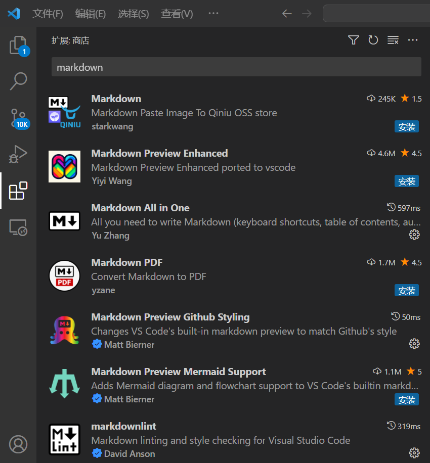
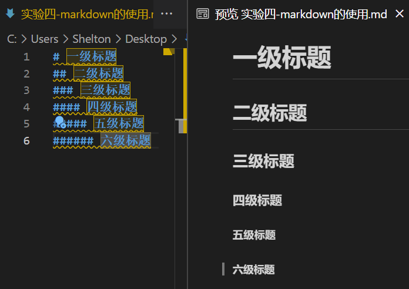
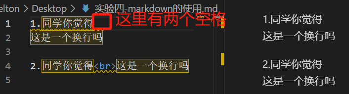
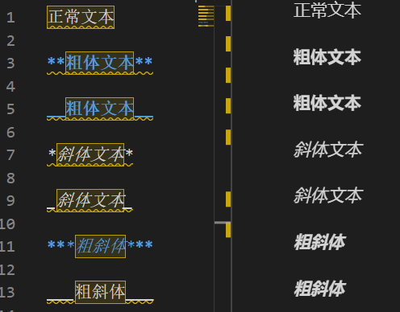
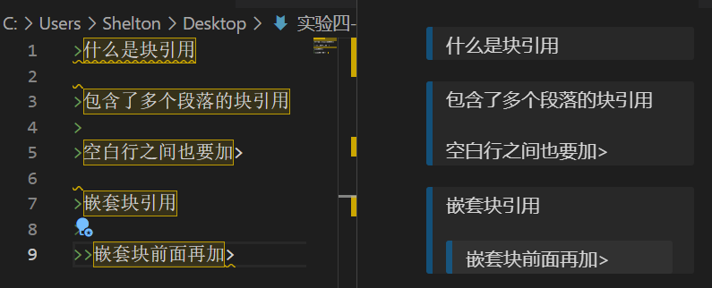
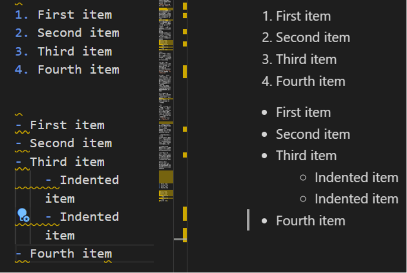
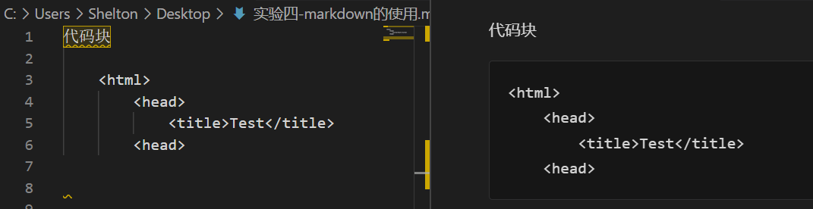
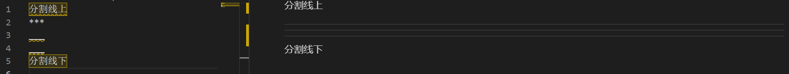
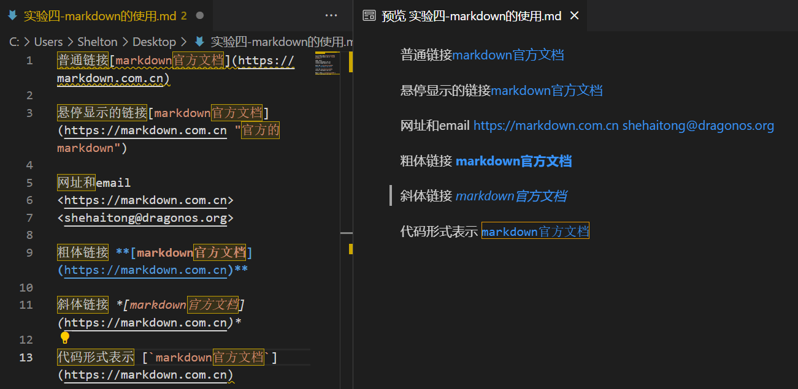
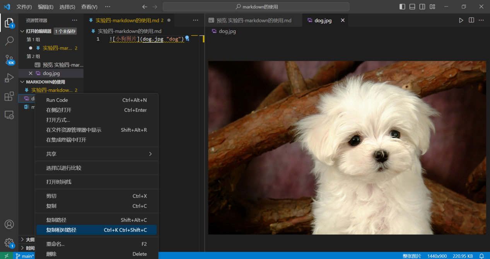

# #4 - markdown的学习
>本文维护者
>
>* 佘海潼 [shehaitong@dragonos.org](shehaitong@dragonos.org "mailto:shehaitong@dragonos.org")
  
>学习目标：
>* 熟悉使用vscode中的markdown扩展<br>
>* 学会markdown基本语法（标题、强调、列表、链接、图片和代码等）<br>
>* 学会应用morkdown格式重新编排你的实验一报告


## **目录**
* [1.Markdown简介](#1)
  - [1.1 什么是Markdown？](#11)
  - [1.2 为什么要使用Markdown？](#12)
* [2.在VS Code中使用Markdown](#2)
  - [2.1 安装Markdown相关扩展](#21)
  - [2.2 Markdown预览功能](#22)
* [3.Markdown基础语法](#3)
  - [3.1 标题](#31)
  - [3.2 段落和换行](#32)
  - [3.3 强调](#33)
  - [3.4 列表](#34)
  - [3.5 引用](#35)
  - [3.6 代码和代码块](#36)
  - [3.7 水平线](#37)
  - [3.8 链接](#38)
  - [3.9 图片](#39)
* [4.实操：应用Markdown重新编排你的实验一报告](#4)
<a id="1"></a>
## 1. Markdown简介
<a id="11"></a>
### 1.1 什么是Markdown？
Markdown是一种轻量级标记语言，它允许人们使用易读易写的纯文本格式编写文档，然后转换成有效的XHTML（或者HTML）文档。这意味着你可以用常规的文本编辑器编写Markdown格式的文档。
<a id="12"></a>
### 1.2 为什么要使用Markdown？
* 简单易学： Markdown的语法简洁明了、学习容易，而且功能实用，初学者很容易上手。
* 兼容HTML： 在Markdown文档中，你可以插入HTML标签，结合Markdown的格式化优势，使内容更丰富。
跨平台使用： Markdown文档可以在不同的文本编辑器和网页浏览器中打开，兼容性强。
专注你的文本内容而不是排版样式，轻松地导出干净、专业的HTML文档。
* 丰富的应用场景：
  - 网站内容
Markdown可以简化HTML的编写，许多网站建设工具允许直接将Markdown转换为网页内容。比如你现在阅读的这个指南就是markdown写的。
  - 文档和资料
对于基础的文件编写，Markdown足矣应对。大多数编辑器可以将Markdown导出为PDF，方便分享和打印。
  - 笔记记录
以Markdown为工具的笔记记录，简洁且易于同步，是数字笔记的理想选择。
  - 电子书制作
通过特定平台，Markdown内容能直接转换为电子书格式，简化了电子书的制作过程。
  - 演示文稿
使用Markdown甚至可以创建演示文稿，提供了一种比传统方式更高效的选择。
  - 邮件编辑
特定工具可将Markdown格式的电子邮件转换为HTML，简化了邮件编辑过程。
  - 技术文档
Markdown广泛用于技术文档编写，其便捷和易读性使其成为技术领域的首选。
<a id="2"></a>
## 2. 在VS Code中使用Markdown
<a id="21"></a>
### 2.1 安装Markdown相关扩展
在VS Code中，你可以安装如Markdown Preview Enhanced、Markdown Lint等插件来进行markdown使用


<a id="22"></a>
### 2.2 Markdown预览功能
安装相应插件后，你可以实时预览Markdown文件的最终输出效果，确保编写的文档格式正确。


<a id="3"></a>
## 3. Markdown基础语法
<a id="31"></a>
### 3.1 标题
Markdown支持6级标题，使用#号标识，数量代表级别。


<a id="32"></a>
### 3.2 段落和换行
段落之间空一行或者在行尾输入两个或更多空格都可实现换行，或者可以使用HTML的标签换行


<a id="33"></a>
### 3.3 强调
- 要加粗文本，请在单词或短语的前后各添加两个星号下划线。   
- 如需加粗一个单词或短语的中间部分用以表示强调的话，请在要加粗部分的两侧各添加两个星号。




<a id="34"></a>
### 3.4 引用
- 要创建块引用，请在段落前添加一个 > 符号。
- 多个段落的块引用
块引用可以包含多个段落。为段落之间的空白行添加一个 > 符号。
- 嵌套块引用：块引用可以嵌套。在要嵌套的段落前添加一个 >> 符号。
使用反引号 `包围代码片段，代码块则使用三个反引号，并可指定语言。



<a id="35"></a>
### 3.5 列表
- 有序列表<br>
要创建有序列表，请在每个列表项前添加数字并紧跟一个英文句点。数字不必按数学顺序排列，但是列表应当以数字 1 起始。
- 无序列表<br>
要创建无序列表，请在每个列表项前面添加破折号 (-)、星号 (*) 或加号 (+) ，注意要再加一个空格。缩进一个或多个列表项可创建嵌套列表。



<a id="36"></a>
### 3.6 代码块
代码块通常采用四个空格或一个制表符缩进。当它们被放在列表中时，请将它们缩进八个空格或两个制表符。
或者在代码块之前和之后的行上注意要换行）使用三个反引号（(```）或三个波浪号（~~~）




<a id="37"></a>
### 3.7 分割线
要创建分隔线，在单独一行上使用三个或多个星号 (***)、破折号 (---) 或下划线 (___) ，并且不能包含其他内容。



<a id="38"></a>
### 3.8 链接和图片
- 链接文本放在中括号内，链接地址放在后面的括号中，链接title可选。

```
[Markdown语法](https://markdown.com.cn)
```

- 给链接增加 Title
链接title是当鼠标悬停在链接上时会出现的文字，这个title是可选的，它放在圆括号中链接地址后面，跟链接地址之间以空格分隔。<br>
```
[Markdown语法](https://markdown.com.cn "最好的markdown教程")
```
- 网址和Email地址
使用尖括号可以很方便地把URL或者email地址变成可点击的链接。<br>
```
<https://markdown.com.cn>
<fake@example.com>
```
- 带格式化的链接
粗体链接, 类比强调中的粗体语法，在链接语法前后增加两个星号。 <br>
```
**[EFF](https://eff.org)**
```
要将链接表示为代码，在方括号中添加反引号。



- 要添加图像，请使用感叹号 (!), 然后在方括号增加替代文本，图片链接（也可以用图片的路径代替）放在圆括号里，括号里的链接后可以增加一个可选的图片标题文本。<br>
```

```


***
>更多操作（表格，脚注，页内跳转等）可查询<https://markdown.com.cn>
<a id="4"></a>
## 4.发挥你的创造力吧
实验要求：请应用Markdown重新编排你的实验一报告<br>最后以压缩包的形式提交本次的作业，包含你的markdown文件和用到的图片


